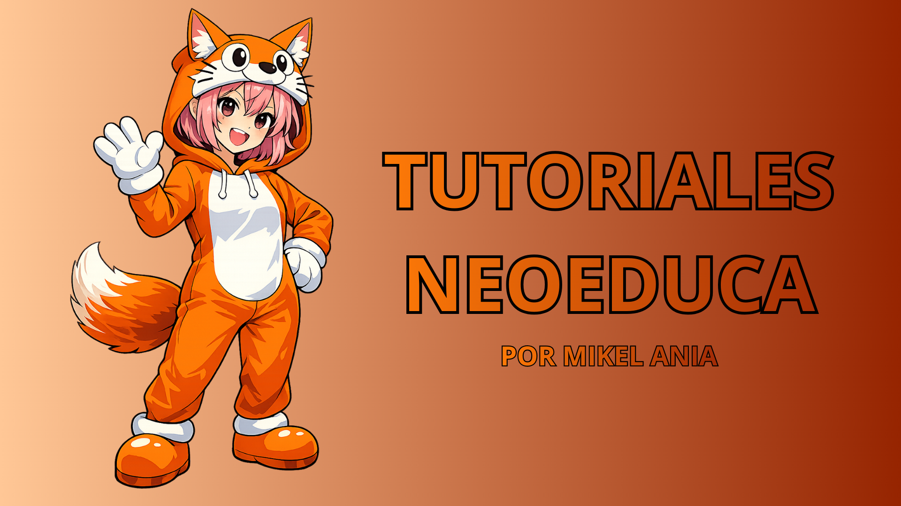

# NeoEduca

# 👋 ¡Bienvenidos a Neoeduca en GitHub!

¡Hola, estudiantes! 🎓  
Bienvenidos al repositorio oficial de **Neoeduca**, el espacio donde aprenderemos, construiremos y compartiremos conocimiento juntos.  

Aquí encontrarás todos los recursos, ejemplos de código, proyectos y guías que utilizaremos durante el curso. Este repositorio será tu compañero de viaje para explorar, practicar y crecer en el mundo del desarrollo y la tecnología. 

---

## 🚀 ¿Qué vas a encontrar aquí?

- 📁 **Materiales del curso:** apuntes, ejercicios y proyectos organizados por módulos.  
- 💡 **Ejemplos prácticos:** fragmentos de código y demostraciones que te ayudarán a entender mejor los conceptos.  
- 🤝 **Colaboración:** podrás contribuir, hacer preguntas y compartir tus propias ideas.  

---

## 🧭 Recomendaciones

1. **Lee bien las instrucciones** de cada carpeta antes de comenzar.  
2. **Explora y experimenta:** no tengas miedo de probar y equivocarte; ¡así se aprende!  
3. **Participa:** deja tus comentarios, propone mejoras y apoya a tus compañeros.  

---

✨ **Recuerda:** aprender a programar no es solo escribir código, sino también pensar, crear y colaborar.  
¡Bienvenido a esta aventura de aprendizaje con Neoeduca! 🚀

## 📘GUIAS DE TRABAJO PARA ESTUDIANTES📘

Aquí dejo los links a todas las guias que tienen el contenido de cada una de las clases del taller.

- [**🐰 Guia de Microblock:**](https://www.canva.com/design/DAGlvREbrtw/-Yj299_fVM7asSBKSx0JyQ/view?utm_content=DAGlvREbrtw&utm_campaign=designshare&utm_medium=link2&utm_source=uniquelinks&utlId=h8d9e5d90d5) Para los estudiantes que usan el programa Microblocks.

- [**🐍 Guia de Python:**](https://www.canva.com/design/DAGuqdyQR_g/8weqsVWsH-k-fPASkV7BxQ/view?utm_content=DAGuqdyQR_g&utm_campaign=designshare&utm_medium=link2&utm_source=uniquelinks&utlId=h9cfc480a7a) Para los estudiantes que usan el programa Thonny.

- [**😼 Guia de Scratch:**](https://www.canva.com/design/DAGvIDVVG-M/o03zC_ENwr96aK-M0AxmQg/edit?utm_content=DAGvIDVVG-M&utm_campaign=designshare&utm_medium=link2&utm_source=sharebutton) Para los estudiantes que usan el programa Scratch.

- [**🧩 Link a Tinkercad:**](https://www.tinkercad.com/joinclass/5W3CWBSRP) Para los estudiantes que trabajan con Diseño 3D.

## 📹TUTORIALES DEL PROFE📹

- **TUTORIALES DISEÑO 3D**
    - [✍🏻 **Diseño 3D: Capsula 1:**](https://youtu.be/gGQJSDf0Rb8) En esta capsula vemos el diseño de llaveros 3d paso a paso.

    - [✍🏻 **Diseño 3D: Capsula 2:**](https://youtu.be/9kSFTCK-G7Y) En esta capsula vemos el diseño de figuras 3d paso a paso.
